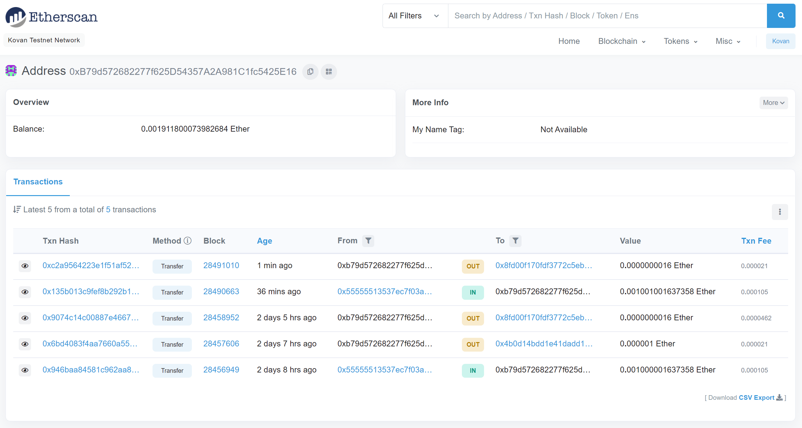
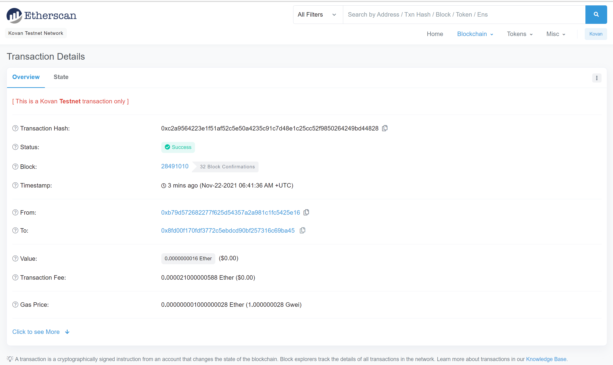
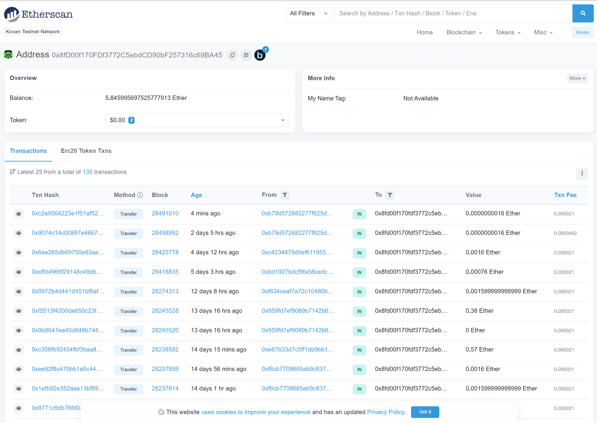

# *Fintech Finder - (m19_challenge_01):*  

## **Description:** 
You work at a startup that is building a new and disruptive platform called Fintech Finder. Fintech Finder is an application that its customers can use to find fintech professionals from among a list of candidates, hire them, and pay them. As Fintech Finder’s lead developer, you have been tasked with integrating the Ethereum blockchain network into the application in order to enable your customers to instantly pay the fintech professionals whom they hire with cryptocurrency. In this Challenge, you will complete the code that enables your customers to send cryptocurrency payments to fintech professionals. To develop the code and test it out, you will assume the perspective of a Fintech Finder customer who is using the application to find a fintech professional and pay them for their work.
 
 

### ***Task 1:*** 
Import Ethereum Transaction Functions into the Fintech Finder Application.
 
### ***Task 2:*** 
Sign and Execute a Payment Transaction.
 
### ***Task 3:*** 
Inspect the Transaction on Etherscan.
 
 

## <U>Screenshots</U>: 
 
 
Screenshot of my address balance and history on Etherscan:
 

 
 

Screenshot of the transaction details on Etherscan:
 

 
 

Screenshot of the recipient’s address balance and history on Etherscan
 

 
 

## <U>Technologies</U>: 
 
The following packages and dependicies are needed for the proper functioning of the application:
 
<b>
streamlit: 
dataclasses: 
typing: 
os: 
dotenv: 
bip44: 
web3: 
</b>
 

---

## Usage

In order to run the program, type the following at the terminal prompt:
* ### streamlit run sr_fintech_finder.py

---

## Contributors

**Name:** Saeed A Raghib 
**Contact:** saeed_raghib@msn.com

---

## License

### Universit of California at Berkeley EXTENSION
